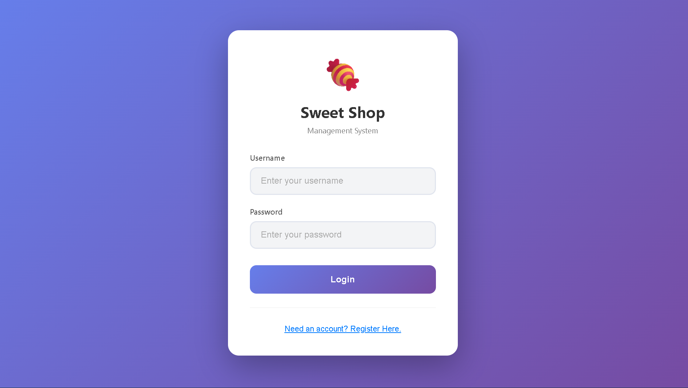
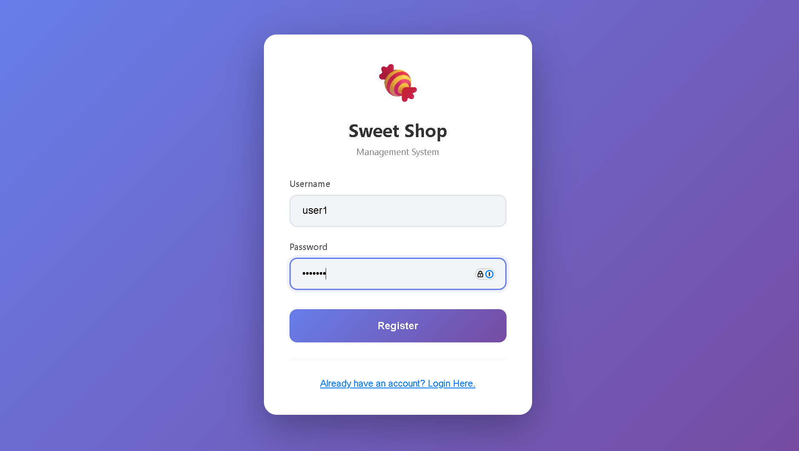
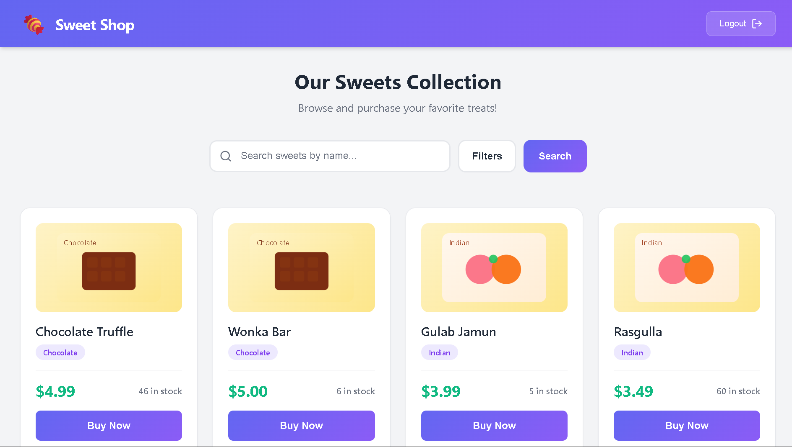
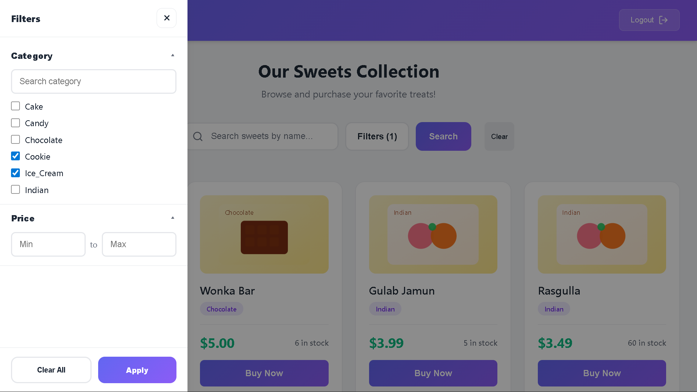
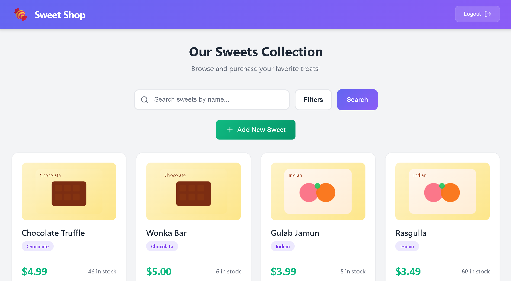
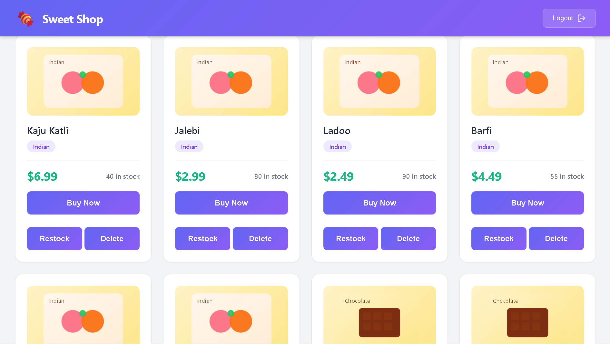

# Sweet Shop Management System

A full-stack Sweet Shop Management System where customers can browse and purchase sweets, and admins can manage inventory (add/restock/delete). The backend is built with **FastAPI + SQLModel (SQLite)** and the frontend is built with **React + Vite**.

## Project Explanation

This project provides:

- A **customer experience**: register/login, browse sweets, filter by category/price, purchase items.
- An **admin experience**: manage inventory through the same dashboard UI (admin-only actions are shown when logged in as an admin).
- A **REST API** with JWT authentication, and a React UI that consumes it.

## Features

- Authentication (Register + Login) using JWT
- Sweets catalog
  - Search by name
  - Filter by category (multi-select) and price range
  - Purchase sweets (stock decrements)
- Admin inventory management
  - Add new sweets
  - Restock sweets
  - Delete sweets
- Sweet images
  - Each sweet includes an optional `image_url`
  - Defaults are assigned automatically based on category

## Tech Stack

- Backend: FastAPI, SQLModel/SQLAlchemy, SQLite, Passlib + bcrypt, python-jose, Pytest
- Frontend: React (Vite), React Router, Axios, CSS

## Local Setup & Run Instructions

### Prerequisites

- Python 3.11+ (recommended)
- Node.js 18+ (recommended)

### Backend (FastAPI)

From the repo root:

```powershell
cd "backend"

# Create venv at repo root (matches this workspace layout)
python -m venv ..\.venv

# Activate
..\.venv\Scripts\Activate.ps1

# Install dependencies
pip install -r requirements.txt

# Run the API
uvicorn main:app --reload
```

Backend URLs:

- API: http://127.0.0.1:8000
- Swagger docs: http://127.0.0.1:8000/docs

Notes:

- CORS is configured for Vite dev ports `5173` and `5174`.
- The database file is created automatically as `backend/sweetshop.db`.

### Seed the Database (Recommended)

This populates sweets (20+). It also backfills `image_url` for older records.

```powershell
cd "backend"
& "..\.venv\Scripts\python.exe" "seed_sweets.py"
```

### Frontend (React + Vite)

In another terminal:

```powershell
cd "frontend"
npm install
npm run dev
```

Frontend URL (default):

- http://localhost:5173

## Usage

### Customer

1. Open the frontend.
2. Register a new account.
3. Login.
4. Browse sweets, apply filters, and click **Buy Now**.

### Admin

Admins use the same dashboard route, but get extra controls:

- **Add New Sweet**
- **Restock**
- **Delete**

Admin creation/reset helpers (for local development):

- `POST /auth/init-admin` – creates the first admin only if no admin exists.
- `POST /auth/dev-reset-admin-password` – dev-only password reset (requires `X-Setup-Key` header matching the backend `SECRET_KEY`).

Important: do not expose the dev reset endpoint publicly in production.

## API Endpoints (Overview)

Common endpoints:

| Method | Endpoint | Description |
| --- | --- | --- |
| `POST` | `/auth/register` | Register a customer |
| `POST` | `/auth/login` | Login (form-encoded) and receive JWT |
| `GET` | `/sweets/` | List sweets |
| `GET` | `/sweets/search` | Search/filter (`name`, `category`, `min_price`, `max_price`) |
| `GET` | `/sweets/{id}` | Get a single sweet |
| `POST` | `/sweets/{id}/purchase` | Purchase (decrement stock) |

Admin-only endpoints (requires admin JWT):

| Method | Endpoint | Description |
| --- | --- | --- |
| `POST` | `/sweets/` | Create a sweet |
| `PUT` | `/sweets/{id}` | Update a sweet |
| `DELETE` | `/sweets/{id}` | Delete a sweet |
| `POST` | `/sweets/{id}/restock?quantity=10` | Restock |

## Screenshots

The screenshots below are currently placeholders committed to the repo. Replace them with real screenshots of your final running app for submission.

How to replace (Windows):

1. Run backend + frontend.
2. Use Snipping Tool (or Win+Shift+S) to capture the screen.
3. Save over the files in `docs/screenshots/` (you can use `.png` and update the links below).








## Testing (Backend)

```powershell
cd "backend"
pytest
```

## Troubleshooting

- If PowerShell has trouble running a python executable with spaces in the path, use the call operator `&`.
- If Vite uses port 5174, the backend CORS config already allows it.

## My AI Usage (Mandatory)

I used AI assistance (GitHub Copilot using **GPT-5.2 (Preview)**) during development for:

- Drafting and refining React UI code and CSS based on requirements
- Debugging runtime UI issues (e.g., state/handler mismatches)
- Debugging backend issues (dependency/version mismatches, CORS)
- Implementing incremental improvements (filters drawer UX, seeding data, adding `image_url` support)
- Writing and polishing project documentation

Verification after AI-assisted changes:

- Ran backend with `uvicorn main:app --reload`
- Ran frontend with `npm run dev`
- Manually tested key flows (register/login, filtering, purchase)
- Ran backend tests with `pytest` where applicable

I reviewed and edited AI outputs to ensure they match the project structure and requirements.
